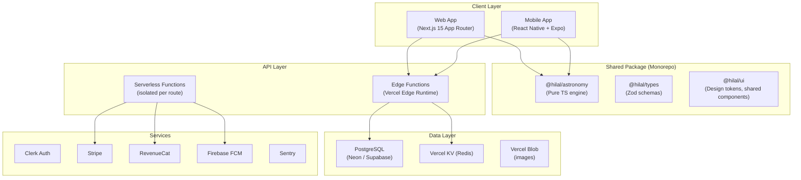

# Hilal Vision — Architecture Review & Rebuild Proposal
Claude AI
## Part 1: What The App Is

**Hilal Vision** is a precision astronomical platform for predicting Islamic crescent moon (hilal) sightings worldwide. It answers: *"Will the new crescent moon be visible tonight from my location?"* — a question of direct religious significance for 1.8 billion Muslims.

### Core Capabilities
- **Visibility prediction** using Yallop (1997) and Odeh (2004) polynomial criteria across a 3D Globe and 2D Map
- **Moon phase dashboard** with altitude charts, sky dome, and ephemeris data
- **Triple-engine Hijri calendar** (Astronomical, Umm al-Qura, Tabular)
- **Horizon simulator** showing moon position relative to setting sun
- **1,000+ real ICOP sighting records** for model validation
- **Crowdsourced telemetry** with server-side astronomical validation
- **Push notifications** for crescent alerts (29th night, eclipses)
- **Pro tier monetization** via Stripe (web) and RevenueCat (iOS/Android)
- **Trilingual i18n** (English, Arabic, Urdu) with full RTL support

---

## Part 2: Current Architecture Analysis

### Tech Stack Summary

| Layer | Current Technology |
|-------|-------------------|
| Frontend | React 19, Vite 7, Tailwind CSS v4, Radix UI, Recharts |
| Mapping | Leaflet, Globe.gl, Three.js, D3 |
| Astronomy | `astronomy-engine` (pure JS), custom shared module |
| Routing | Wouter (lightweight) |
| State | React Context (GlobalState, ProTier, Theme) + React Query |
| API | tRPC 11 (type-safe RPC) + Express REST endpoints |
| Auth | Clerk |
| Database | MySQL (Railway/TiDB) via Drizzle ORM |
| Rate limit | Upstash Redis (with local fallback) |
| Mobile | Capacitor.js wrapping the web build |
| Deploy | Vercel (static frontend + single serverless function) |
| Monitoring | Sentry |
| Push | Firebase Cloud Messaging (FCM) |
| Payments | Stripe (web) + RevenueCat (native) |

---

### Identified Bottlenecks & Failure Points

#### 🔴 Critical Issues

**1. Monolithic Serverless Function**
- [api/index.ts](file:///c:/Users/rayan/Desktop/Antigravity%20workspaces/Moon-dashboard/api/index.ts) is a single handler routing **everything**: tRPC, REST v1, Stripe checkout, Stripe webhooks, RevenueCat webhooks, push notifications, and cron jobs
- **Impact**: A crash in *any* handler takes down *all* API routes. Cold starts are heavier because the entire handler tree must initialize
- **Risk**: Vercel's 10s execution limit applies to this monolith — one slow external call (Open-Meteo, Stripe, MySQL) can cascade

**2. MySQL Connection Pool in Serverless**
- [server/db.ts](file:///c:/Users/rayan/Desktop/Antigravity%20workspaces/Moon-dashboard/server/db.ts) uses a module-level singleton pool (`connectionLimit: 3`) that persists only within a single warm instance
- **Impact**: Under load, multiple Vercel instances each create 3 connections → exhausts Railway/TiDB connection limits → `FUNCTION_INVOCATION_FAILED`
- **History**: This has already caused production outages (Round 43 fixes)

**3. Capacitor Hardcoded API URL**
- [main.tsx](file:///c:/Users/rayan/Desktop/Antigravity%20workspaces/Moon-dashboard/client/src/main.tsx) hardcodes `https://moon-dashboard-one.vercel.app` for native API calls
- **Impact**: No staging/dev environment for mobile testing. Any domain change requires app store re-releases

**4. Service Worker Fragility**
- Hand-written `sw.js` with manual cache versioning (`v2`) and custom tRPC error synthesis
- **Impact**: Cache invalidation bugs are a common source of "stale app" user complaints. The SW must manually parse tRPC batch URLs and construct matching error arrays — brittle

**5. Dual getDem Procedure**
- [appRouter.ts](file:///c:/Users/rayan/Desktop/Antigravity%20workspaces/Moon-dashboard/server/appRouter.ts) defines `getDem` procedure in **both** `demRouter` AND `environment` router — identical code duplicated at lines 113-126 and 289-301
- **Impact**: Maintenance burden, confusion about which endpoint clients use

#### 🟡 Moderate Issues

**6. 40KB Monolithic Astronomy Engine**
- [shared/astronomy.ts](file:///c:/Users/rayan/Desktop/Antigravity%20workspaces/Moon-dashboard/shared/astronomy.ts) is 843+ lines covering Yallop, Odeh, Hijri calendars, visibility grids, refraction, best-time-to-observe — all in one file
- **Impact**: Any change risks regressions across unrelated features. Not tree-shakable

**7. Giant Page Components**
- [AboutPage.tsx](file:///c:/Users/rayan/Desktop/Antigravity%20workspaces/Moon-dashboard/client/src/pages/AboutPage.tsx) (33KB), [MethodologyPage.tsx](file:///c:/Users/rayan/Desktop/Antigravity%20workspaces/Moon-dashboard/client/src/pages/MethodologyPage.tsx) (31KB), [SupportPage.tsx](file:///c:/Users/rayan/Desktop/Antigravity%20workspaces/Moon-dashboard/client/src/pages/SupportPage.tsx) (31KB) — these are massive single-file components with hardcoded content
- **Impact**: Not maintainable. Content changes require code deployments. No CMS separation

**8. SuperJSON Transformer Coupling**
- tRPC uses `superjson` for serialization, but Vercel cold-start HTML 500s bypass it → requires manual JSON wrapping in [api/index.ts](file:///c:/Users/rayan/Desktop/Antigravity%20workspaces/Moon-dashboard/api/index.ts) catch block
- **Impact**: Two separate locations must agree on the error format. Previous bugs here caused "Missing result" errors on Android (Round 39)

**9. No Database Migrations in CI**
- Schema changes use `drizzle-kit generate && drizzle-kit migrate` manually
- **Impact**: Schema drift between environments. No rollback path

**10. 135 Dependencies**
- [package.json](file:///c:/Users/rayan/Desktop/Antigravity%20workspaces/Moon-dashboard/package.json) has 87 production + 33 dev dependencies including heavyweights: Three.js, Globe.gl, D3, Firebase, Firebase Admin, Leaflet, Recharts
- **Impact**: Large bundle despite code-splitting. Slow installs. Supply chain risk

**11. Context-Heavy State Architecture**
- 7 nested providers in [App.tsx](file:///c:/Users/rayan/Desktop/Antigravity%20workspaces/Moon-dashboard/client/src/App.tsx) (Sentry → Helmet → Clerk → Theme → GlobalState → ProTier → Tooltip)
- **Impact**: Deep provider tree causes unnecessary re-renders. Adding state requires another wrapper

**12. No Edge Caching / CDN Strategy**
- Astronomical calculations for visibility grids are repeated for every user visiting the same date
- **Impact**: Redundant computation. The visibility grid for "today" is identical for all users globally — could be pre-computed and cached

---

## Part 3: Rebuild Proposal — How I Would Build This From Scratch

### Guiding Principles

1. **Computation belongs at the edge, not in serverless** — Astronomical calculations are pure math with no side effects. They should run client-side (Web Workers) or be pre-computed and edge-cached
2. **The server does three things only**: persists data, authenticates users, and proxies external APIs
3. **One codebase, truly native rendering** — Not Capacitor wrapping a WebView. Use React Native for genuinely native iOS/Android with shared business logic
4. **Eliminate single points of failure** — Every external dependency must have a fallback. Every serverless function must be isolated
5. **Content ≠ Code** — Static pages (About, Methodology, Privacy, Terms) should be content-driven, not component-driven

---

### Proposed Architecture



---

### Stack Choices & Rationale

| Layer | Proposed | Why |
|-------|----------|-----|
| **Monorepo** | Turborepo + pnpm workspaces | Share astronomy engine, types, and UI tokens across web and mobile without publishing packages |
| **Web** | Next.js 15 (App Router) | Server Components for static pages, Edge Runtime for API routes, built-in image optimization, ISR for pre-computed visibility maps |
| **Mobile** | React Native + Expo | Genuinely native rendering (not WebView). Share the `@hilal/astronomy` package. Native maps via `react-native-maps`. Native Clerk SDK. RevenueCat native SDK works natively |
| **Styling** | Tailwind CSS v4 (web) + NativeWind (mobile) | Same design tokens, different renderers. Shared color palette via `@hilal/ui` |
| **API** | Next.js Route Handlers (Edge + Node) | No separate Express server. Each route is its own isolated serverless function. Edge Runtime for read-heavy routes (visibility, moon phases). Node runtime for Stripe/webhook handlers |
| **Type Safety** | Zod schemas in `@hilal/types` | Shared validation between web, mobile, and API without tRPC coupling. tRPC is optional for web (Next.js server actions work natively) |
| **Database** | PostgreSQL (Neon serverless) | Neon's serverless driver (`@neondatabase/serverless`) uses HTTP/WebSocket — no connection pooling issues. Automatic scaling. Branching for preview deployments |
| **Cache** | Vercel KV (Redis) | First-class Vercel integration. Rate limiting, session cache, pre-computed visibility results |
| **Auth** | Clerk (unchanged) | Already well-integrated. Use `@clerk/nextjs` (web) and `@clerk/expo` (mobile) — both have first-party SDKs |
| **Payments** | Stripe (web) + RevenueCat (mobile) | Keep split. RevenueCat has a React Native SDK that works natively (not Capacitor bridge) |
| **Maps** | MapLibre GL JS (web) + react-native-maps (mobile) | MapLibre is WebGL-native (faster than Leaflet), open-source (no Mapbox token). Globe rendering via custom WebGL shader or `globe.gl` retained. Mobile uses native MapKit/Google Maps |
| **Astronomy** | `@hilal/astronomy` monorepo package | Same engine, split into submodules: `yallop.ts`, `odeh.ts`, `hijri.ts`, `grid.ts`, `refraction.ts`, `best-time.ts`. Each independently testable and tree-shakable |
| **Push** | Firebase FCM (unchanged) | Use `@react-native-firebase/messaging` on mobile (native, not Capacitor bridge), web FCM service worker |
| **Monitoring** | Sentry | `@sentry/nextjs` (web) + `@sentry/react-native` (mobile) |
| **Content** | MDX files in repo | About, Methodology, Privacy, Terms pages rendered from MDX via Next.js — content editable without touching React components |

---

### Monorepo Structure

```
hilal-vision/
├── apps/
│   ├── web/                        ← Next.js 15 App Router
│   │   ├── app/
│   │   │   ├── (marketing)/        ← Static pages (About, Methodology, Privacy, Terms)
│   │   │   ├── (dashboard)/        ← App pages (Visibility, Moon, Calendar, etc.)
│   │   │   └── api/                ← Route Handlers (isolated serverless functions)
│   │   │       ├── trpc/[trpc]/route.ts
│   │   │       ├── stripe/checkout/route.ts
│   │   │       ├── stripe/webhook/route.ts
│   │   │       ├── revenuecat/webhook/route.ts
│   │   │       ├── push/send/route.ts
│   │   │       └── cron/moon-alerts/route.ts
│   │   └── content/                ← MDX files for static pages
│   │
│   └── mobile/                     ← React Native + Expo
│       ├── app/                    ← Expo Router screens
│       ├── components/
│       └── services/
│
├── packages/
│   ├── astronomy/                  ← @hilal/astronomy (pure TS, no DOM)
│   │   ├── src/
│   │   │   ├── yallop.ts
│   │   │   ├── odeh.ts
│   │   │   ├── hijri.ts
│   │   │   ├── grid.ts
│   │   │   ├── refraction.ts
│   │   │   ├── best-time.ts
│   │   │   ├── terminator.ts
│   │   │   └── index.ts
│   │   └── __tests__/
│   │
│   ├── types/                      ← @hilal/types (Zod schemas, shared interfaces)
│   │
│   ├── ui/                         ← @hilal/ui (design tokens, shared component APIs)
│   │   ├── tokens/                 ← Color palette, typography, spacing
│   │   └── components/             ← Platform-agnostic component contracts
│   │
│   └── db/                         ← @hilal/db (Drizzle schema, migrations, queries)
│       ├── schema.ts
│       ├── migrations/
│       └── queries/
│
├── turbo.json
├── pnpm-workspace.yaml
└── .github/workflows/ci.yml
```

---

### How Each Current Bottleneck Is Solved

| Current Problem | Rebuild Solution |
|-----------------|-----------------|
| Monolithic serverless function | Each API route is a **separate Next.js Route Handler** — isolated cold starts, independent failure domains |
| MySQL connection pool exhaustion | **Neon serverless PostgreSQL** — HTTP-based driver, no connection pooling needed. Each invocation opens/closes over HTTP |
| Hardcoded Capacitor API URL | React Native uses **environment-driven API URL** via Expo config (`app.config.ts`). Staging/prod/dev all configurable without code changes |
| Fragile hand-written Service Worker | Next.js **`next-pwa`** or **Serwist** handles SW generation with automatic cache busting, precaching, and runtime caching strategies |
| Duplicated getDem procedure | Single `@hilal/astronomy` package with one elevation function, consumed by whichever route needs it |
| 40KB monolithic astronomy module | Split into 7 focused submodules in `@hilal/astronomy`. Each independently importable and testable |
| Giant page components (33KB each) | Static pages use **MDX** — content in markdown, rendered by Next.js. Dynamic pages use focused, composable components |
| SuperJSON error format coupling | Next.js Route Handlers return standard `Response` objects. tRPC is optional (used for complex queries). No transformer coupling for basic routes |
| Manual database migrations | **Drizzle Kit** migrations run as part of CI/CD pipeline. Preview deployments use Neon database branches |
| 135 dependencies | Fewer dependencies by eliminating Express, superjson, wouter, Capacitor ecosystem. MapLibre replaces Leaflet (smaller, WebGL-native) |
| 7 nested context providers | **Zustand** for global state (1 store, no providers). Clerk and React Query providers remain (unavoidable) |
| No edge caching | Next.js **ISR (Incremental Static Regeneration)** for visibility maps. Pre-compute "today's" grid every hour via cron, serve from edge cache. 95% of users see pre-computed results |

---

### Edge-Computed Visibility (Key Innovation)

The current app recomputes the visibility grid on every client for every visit. This is wasteful — the grid for a given date is identical globally.

**Proposed flow:**
1. A **Vercel cron job** runs every hour, calling `@hilal/astronomy.generateVisibilityGrid()` for today and tomorrow at 4° resolution
2. The result is stored in **Vercel KV** (Redis) as a compressed JSON blob, keyed by date
3. When a user visits `/visibility`, the **Edge Function** serves the pre-computed grid from KV in <50ms
4. The client-side Web Worker only runs for **custom dates** (user picks a past/future date not in cache)
5. Higher-resolution (2°) grids are computed client-side on demand — the pre-computed 4° grid is the instant preview

**Result:** First meaningful paint for the visibility map drops from ~800ms (current worker computation) to **<50ms** (edge-cached JSON).

---

### Data Architecture

```sql
-- PostgreSQL (Neon) — cleaner schema, native JSON, better indexing

-- Users (synced from Clerk webhooks)
CREATE TABLE users (
  clerk_id        TEXT PRIMARY KEY,
  email           TEXT,
  display_name    TEXT,
  is_pro          BOOLEAN DEFAULT FALSE,
  observer_badge  TEXT DEFAULT 'Novice',
  sighting_count  INT DEFAULT 0,
  created_at      TIMESTAMPTZ DEFAULT now(),
  updated_at      TIMESTAMPTZ DEFAULT now()
);

-- Observation Reports (crowdsourced sightings)
CREATE TABLE observations (
  id              SERIAL PRIMARY KEY,
  user_id         TEXT REFERENCES users(clerk_id),
  location        GEOGRAPHY(POINT, 4326),  -- PostGIS for spatial queries
  observed_at     TIMESTAMPTZ NOT NULL,
  temperature_c   NUMERIC(5,2),
  pressure_hpa    NUMERIC(7,2),
  cloud_pct       NUMERIC(5,2),
  aod             NUMERIC(6,4),
  result          TEXT NOT NULL CHECK (result IN ('naked_eye','optical_aid','not_seen')),
  notes           TEXT,
  image_url       TEXT,
  created_at      TIMESTAMPTZ DEFAULT now()
);
CREATE INDEX ON observations USING GIST(location);
CREATE INDEX ON observations(observed_at DESC);

-- Push Notification Tokens
CREATE TABLE push_tokens (
  token       TEXT PRIMARY KEY,
  user_id     TEXT REFERENCES users(clerk_id),
  platform    TEXT CHECK (platform IN ('web','ios','android')),
  created_at  TIMESTAMPTZ DEFAULT now()
);

-- Stripe Customer Mapping
CREATE TABLE stripe_customers (
  clerk_id            TEXT PRIMARY KEY REFERENCES users(clerk_id),
  stripe_customer_id  TEXT UNIQUE NOT NULL,
  created_at          TIMESTAMPTZ DEFAULT now()
);

-- Email Signups
CREATE TABLE email_signups (
  email       TEXT PRIMARY KEY,
  created_at  TIMESTAMPTZ DEFAULT now()
);
```

> [!TIP]
> PostgreSQL's `GEOGRAPHY` type (via PostGIS) enables spatial queries like "find all observations within 50km of Mecca" — impossible with the current MySQL decimal lat/lng approach.

---

### Mobile Architecture (React Native vs Capacitor)

| Dimension | Current (Capacitor) | Proposed (React Native + Expo) |
|-----------|-------------------|-------------------------------|
| **Rendering** | WebView wrapping web bundle | Native UI components (UIKit / Jetpack Compose) |
| **Maps** | Leaflet inside WebView (DOM) | `react-native-maps` (MapKit / Google Maps native) |
| **3D Globe** | Globe.gl inside WebView (double WebGL overhead) | `expo-gl` + Three.js (single GL context) |
| **Auth** | Clerk via browser redirect | `@clerk/expo` (native SDK, no browser popup) |
| **Payments** | RevenueCat Capacitor bridge | `react-native-purchases` (native SDK) |
| **GPS** | `@capacitor/geolocation` bridge | `expo-location` (native, background support) |
| **Push** | FCM via Capacitor bridge | `@react-native-firebase/messaging` (native) |
| **Performance** | JS thread in WebView (single-threaded) | Hermes JS engine + native modules (multi-threaded) |
| **Bundle** | Entire web bundle including Leaflet CSS | Tree-shaken native modules, no web overhead |
| **OTA Updates** | App store re-release required | Expo Updates (OTA, no store review) |

> [!IMPORTANT]
> The astronomy engine (`@hilal/astronomy`) is **100% shared** between web and mobile. It runs in Web Workers on web and on the Hermes JS thread on mobile. No code duplication.

---

### Development Workflow

```
┌─────────────────────────────────────────────────────┐
│  Developer pushes to GitHub                         │
├─────────────────────────────────────────────────────┤
│  CI Pipeline (GitHub Actions)                       │
│  1. Lint + Type Check (turbo)                       │
│  2. Unit Tests — @hilal/astronomy (vitest)          │
│  3. Unit Tests — @hilal/db (vitest)                 │
│  4. Integration Tests — API routes (vitest)         │
│  5. E2E Tests — web (Playwright)                    │
│  6. Build web (next build)                          │
│  7. Build mobile checks (expo doctor)               │
├─────────────────────────────────────────────────────┤
│  Preview Deployment                                 │
│  - Vercel preview (web) with Neon branch DB         │
│  - EAS preview build (mobile) via QR code           │
├─────────────────────────────────────────────────────┤
│  Production Deployment                              │
│  - Merge to main → Vercel production                │
│  - Tag release → EAS submit to App Store/Play Store │
│  - Expo OTA update for JS-only changes              │
└─────────────────────────────────────────────────────┘
```

---

### Migration Strategy (If Rebuilding Incrementally)

For a pragmatic rebuild from the current codebase:

| Phase | Effort | Impact |
|-------|--------|--------|
| **1. Monorepo setup** | 2 days | Extract `@hilal/astronomy`, `@hilal/types`, `@hilal/db` into packages. Current app continues working |
| **2. Split astronomy module** | 1 day | Break 843-line file into 7 submodules with barrel export. Zero functional change |
| **3. PostgreSQL migration** | 2 days | Switch from MySQL to Neon PostgreSQL. Migrate 5 tables. Eliminate connection pool issues permanently |
| **4. Isolated API routes** | 2 days | Replace monolithic [api/index.ts](file:///c:/Users/rayan/Desktop/Antigravity%20workspaces/Moon-dashboard/api/index.ts) with individual Next.js Route Handlers. Each handler fails independently |
| **5. Edge-cached visibility** | 1 day | Pre-compute daily visibility grids, serve from Vercel KV. Dramatic performance improvement |
| **6. MDX content pages** | 1 day | Move About, Methodology, Privacy, Terms from 33KB React components to MDX files |
| **7. React Native mobile** | 2-3 weeks | New mobile app using shared `@hilal/astronomy` package. Native maps, native auth, native payments |
| **8. Service Worker automation** | 1 day | Replace hand-written `sw.js` with Serwist/next-pwa |

> [!CAUTION]
> **Phase 7 (React Native) is the largest investment** but delivers the highest return. Capacitor WebView apps will always feel second-class compared to native rendering — especially for a map-heavy, GL-heavy app like this. Every performance issue, CORS workaround, and auth redirect hack in the current codebase traces back to the WebView constraint.

---

### Summary

The current Hilal Vision codebase is **functionally impressive** — 44 rounds of iteration have produced a genuinely sophisticated astronomical platform with real scientific value. The pain points are architectural (monolithic serverless, MySQL in serverless, Capacitor WebView), not functional.

A from-scratch rebuild should keep:
- ✅ The astronomy engine (extract, modularize, share)
- ✅ The design system (Breezy Weather aesthetic, OKLCH palette)
- ✅ Clerk auth, Stripe/RevenueCat payments
- ✅ The ICOP dataset and telemetry pipeline
- ✅ The test suite (144 unit tests, 11 E2E tests)

A from-scratch rebuild should change:
- 🔄 Express + tRPC + single serverless → **Next.js Route Handlers** (isolated, edge-capable)
- 🔄 MySQL + connection pools → **Neon PostgreSQL** (HTTP-based, serverless-native)
- 🔄 Capacitor WebView → **React Native + Expo** (genuine native)
- 🔄 Monolithic shared module → **Monorepo packages** (astronomy, types, UI, db)
- 🔄 Hand-written SW → **Automated PWA tooling**
- 🔄 Giant page components → **MDX content** + focused components
- 🔄 Context providers → **Zustand** global store
