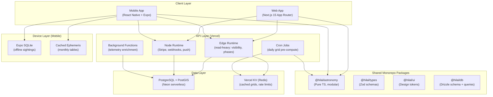

# Hilal Vision — Unified Rebuild Plan

> This plan synthesizes two independent architecture reviews (Claude AI and Gemini AI) into a single, opinionated blueprint for rebuilding the app from scratch.

---

## Executive Assessment

Both reviews converge on the same diagnosis: Hilal Vision is **functionally exceptional** but **architecturally fragile**. They independently identified the same four root causes of instability:

| Root Cause | Claude's Framing | Gemini's Framing |
|:---|:---|:---|
| **WebView mobile** | Capacitor wrapping a web build → CORS, auth redirect hacks, double WebGL overhead | WebView JS engine draining battery, WebGL context loss on old Android |
| **Monolith serverless** | Single [api/index.ts](file:///c:/Users/rayan/Desktop/Antigravity%20workspaces/Moon-dashboard/api/index.ts) handler → any crash kills all routes, cold starts are heavy | Vercel 10s timeout + synchronous external API calls create cascading deadlocks |
| **MySQL in serverless** | `mysql2` TCP pool (`connectionLimit: 3`) per warm instance → connection exhaustion | "Known anti-pattern" — hundreds of lambda instances each opening TCP pools |
| **Brittle error pipeline** | SuperJSON transformer coupling, hand-written SW tRPC error synthesis | "Triple Format" trap — SW, client fetch, and backend all craft synthetic JSON |

---

## Where the Reviews Agree

These decisions are unanimous and should be adopted without question:

| Decision | Rationale |
|:---|:---|
| **Drop Capacitor → React Native + Expo** | Both reviews independently chose this. Native rendering, native SDKs (Clerk, RevenueCat, FCM), native maps. Eliminates the entire class of WebView bugs |
| **Drop MySQL TCP → HTTP-native database** | Both reviews insist on an HTTP/WebSocket database driver to solve connection exhaustion permanently |
| **Monorepo with shared packages** | Both propose `@hilal/astronomy` as a shared pure-TS package consumed by web and mobile |
| **Isolated API routes** | Both proposals split the monolithic handler into independent functions with isolated failure domains |
| **Clerk stays** | Both keep Clerk, upgrading from `@clerk/clerk-react` to platform-native SDKs (`@clerk/nextjs`, `@clerk/expo`) |
| **Stripe (web) + RevenueCat (mobile) stays** | Both retain the dual payment strategy with native SDKs replacing Capacitor bridges |
| **Modularize the astronomy engine** | Both propose splitting the 843-line [shared/astronomy.ts](file:///c:/Users/rayan/Desktop/Antigravity%20workspaces/Moon-dashboard/shared/astronomy.ts) into focused submodules |

---

## Where the Reviews Diverge (and My Verdict)

### 1. Web Framework

| | Claude's Pick | Gemini's Pick | **Verdict** |
|:---|:---|:---|:---|
| Framework | Next.js 15 (App Router) | Expo Router (unified web+native) | **Next.js 15 for web** |

**Reasoning:** Expo's web support (`react-native-web`) is production-viable but still has rough edges with complex WebGL (Globe.gl, Three.js) and map libraries. Next.js offers Server Components for static pages, ISR for pre-computed visibility data, Edge Runtime for API routes, and a mature ecosystem for SEO-critical pages (About, Methodology). The web app is the primary platform — it should use a web-first framework.

> [!IMPORTANT]
> This means **two separate client apps** in the monorepo (`apps/web` + `apps/mobile`), sharing packages but using platform-optimal frameworks. This is the same conclusion Claude reached.

---

### 2. Compute Engine (JS vs Rust/Wasm)

| | Claude's Pick | Gemini's Pick | **Verdict** |
|:---|:---|:---|:---|
| Language | TypeScript (shared via monorepo) | Rust → Wasm (web) + JSI (mobile) | **TypeScript now, Wasm later** |

**Reasoning:** Gemini's proposal for Rust/Wasm is technically superior — near-native grid computation would reduce 800ms → <50ms. However, it introduces significant complexity:
- Requires Rust toolchain expertise for future maintainers
- JSI C++ bindings for React Native add a fragile native layer
- Doubles the build pipeline complexity (Cargo + Turbo + EAS)

The pragmatic path is Claude's: keep the engine in TypeScript, split it into submodules, and **combine it with edge pre-computation** (the cron-to-KV pipeline). For 95% of users who visit "today's" visibility map, the pre-computed edge cache delivers <50ms anyway — without Rust.

> [!TIP]
> **Wasm should be a Phase 2 optimization** — once the rebuild is stable, the `@hilal/astronomy` package interface stays the same; the internals can be swapped to Wasm without touching consumers.

---

### 3. Backend Platform

| | Claude's Pick | Gemini's Pick | **Verdict** |
|:---|:---|:---|:---|
| Platform | Vercel (Next.js Route Handlers) | Cloudflare Workers (Hono.js) | **Vercel with Next.js** |

**Reasoning:** Cloudflare Workers have legitimate advantages (0ms cold starts, V8 isolates). But switching to Cloudflare introduces:
- A split deployment (Vercel for web hosting + Cloudflare for API) OR abandoning Vercel entirely
- Loss of Vercel's integrated preview deployments, analytics, and seamless Next.js integration
- Cloudflare D1 (SQLite) is still beta-quality for relational schemas with PostGIS-style spatial queries
- Learning curve for Hono.js when Next.js Route Handlers are already isolated and edge-capable

Staying on Vercel with isolated Next.js Route Handlers gives 90% of the benefit with 10% of the migration risk. The key insight from Gemini — **0ms cold starts matter** — is addressed by using Vercel Edge Runtime for read-heavy routes (visibility, moon phases) which also run on V8 isolates.

---

### 4. Database

| | Claude's Pick | Gemini's Pick | **Verdict** |
|:---|:---|:---|:---|
| Database | Neon PostgreSQL (serverless) | Cloudflare D1 / Turso (libsql) | **Neon PostgreSQL** |

**Reasoning:** PostgreSQL with Neon wins decisively:
- **PostGIS** enables spatial queries ("find sightings near Mecca") — impossible with SQLite/D1
- Neon's **serverless driver** (`@neondatabase/serverless`) uses HTTP/WebSocket — same zero-connection-pool benefit as D1
- **Database branching** for preview deployments — each PR gets its own DB branch
- Drizzle ORM already supports PostgreSQL — minimal migration friction
- D1 is still production-limited (max 10GB, no PostGIS, limited concurrent writers)

---

### 5. Map Rendering

| | Claude's Pick | Gemini's Pick | **Verdict** |
|:---|:---|:---|:---|
| Web Maps | MapLibre GL JS | Mapbox GL JS | **MapLibre GL JS** |
| Mobile Maps | react-native-maps (MapKit/Google Maps) | @rnmapbox/maps | **react-native-maps** |

**Reasoning:** MapLibre is open-source (no API key required, no usage billing), WebGL-native, and lighter than Leaflet. Mapbox has marginally better features but adds vendor lock-in and recurring costs. For mobile, `react-native-maps` uses the platform's native map SDK (Apple Maps / Google Maps) — better memory management and smoother scrolling than any third-party renderer.

---

### 6. Telemetry Pipeline

| | Claude's Pick | Gemini's Pick | **Verdict** |
|:---|:---|:---|:---|
| Ingestion | Synchronous (current) | Async via Cloudflare Queues | **Async via Vercel background functions** |

**Reasoning:** Gemini correctly identifies that weather API lookups should not block user sighting submissions. Since we're staying on Vercel, use **Vercel Background Functions** (or a simple Inngest/QStash job) to acknowledge the sighting immediately, then enrich it with Open-Meteo data asynchronously. Same decoupled UX, no Cloudflare dependency.

---

### 7. Offline Support

| | Claude's Pick | Gemini's Pick | **Verdict** |
|:---|:---|:---|:---|
| Offline | Not addressed | Expo SQLite + background sync + pre-cached ephemeris | **Adopt Gemini's proposal** |

**Reasoning:** This is Gemini's strongest unique contribution. Astronomers observe from remote locations with no connectivity. Embedding:
- **Expo SQLite** for offline sighting drafts
- **Background sync** on reconnection
- **Pre-computed monthly ephemeris tables** cached on-device

This transforms the app from "requires internet" to "works anywhere, syncs later" — a genuine competitive advantage.

---

## Unified Architecture



---

## Unified Tech Stack

| Layer | Technology | Why |
|:---|:---|:---|
| **Monorepo** | Turborepo + pnpm workspaces | Shared packages across web/mobile, parallel builds |
| **Web** | Next.js 15 (App Router) | SSR/ISR for static pages, Edge Runtime for API, integrated Vercel deployment |
| **Mobile** | React Native + Expo (Expo Router) | Native UI, native SDKs, OTA updates, offline SQLite |
| **Styling** | Tailwind CSS v4 (web) + NativeWind (mobile) | Shared tokens via `@hilal/ui`, platform-native renderers |
| **State** | Zustand (global store) | Replaces 7 nested Context providers. Single store, no re-render cascades |
| **API** | Next.js Route Handlers (Edge + Node) | Each route = isolated serverless function. Edge for reads, Node for writes |
| **Type Safety** | Zod schemas in `@hilal/types` | Shared validation. tRPC optional for complex queries, Server Actions for mutations |
| **Database** | PostgreSQL + PostGIS (Neon) | HTTP driver, serverless-native, spatial queries, DB branching |
| **Cache** | Vercel KV (Redis) | Pre-computed visibility grids, rate limiting, session cache |
| **Auth** | Clerk (`@clerk/nextjs` + `@clerk/expo`) | Native SDKs per platform, no WebView redirects |
| **Payments** | Stripe (web) + RevenueCat RN SDK (mobile) | Native payment flows, no Capacitor bridges |
| **Maps** | MapLibre GL JS (web) + react-native-maps (mobile) | Open-source WebGL maps, native platform maps |
| **3D Globe** | Globe.gl / Three.js (web), expo-gl + Three.js (mobile) | Single GL context on mobile (not double WebGL in WebView) |
| **Astronomy** | `@hilal/astronomy` (modular TS) | Split into 7 submodules, independently testable and tree-shakable |
| **Push** | FCM: `@sentry/nextjs` + `@react-native-firebase/messaging` | Native SDKs, no bridges |
| **Content** | MDX (static pages) | About, Methodology, Privacy, Terms rendered from markdown — no code deploys for content |
| **Monitoring** | Sentry (`@sentry/nextjs` + `@sentry/react-native`) | Unified error tracking across platforms |
| **Offline** | Expo SQLite + background sync + cached ephemeris | Sightings work offline, sync on reconnect |
| **PWA** | Serwist / next-pwa | Automated SW generation, cache busting, precaching |
| **CI/CD** | GitHub Actions + Turborepo | Lint → types → unit tests → integration → E2E → build → deploy |

---

## Monorepo Structure

```
hilal-vision/
├── apps/
│   ├── web/                          ← Next.js 15 App Router
│   │   ├── app/
│   │   │   ├── (marketing)/          ← MDX: About, Methodology, Privacy, Terms
│   │   │   ├── (dashboard)/          ← App pages: Visibility, Moon, Calendar, etc.
│   │   │   └── api/                  ← Isolated Route Handlers
│   │   │       ├── trpc/[trpc]/route.ts
│   │   │       ├── stripe/checkout/route.ts
│   │   │       ├── stripe/webhook/route.ts
│   │   │       ├── revenuecat/webhook/route.ts
│   │   │       ├── push/send/route.ts
│   │   │       └── cron/visibility/route.ts
│   │   ├── content/                  ← MDX content files
│   │   └── public/                   ← Static assets
│   │
│   └── mobile/                       ← React Native + Expo
│       ├── app/                      ← Expo Router screens
│       ├── components/
│       ├── services/
│       │   ├── offlineStore.ts       ← Expo SQLite for offline sightings
│       │   └── backgroundSync.ts     ← Sync queue on reconnect
│       └── assets/
│           └── ephemeris/            ← Pre-computed monthly tables
│
├── packages/
│   ├── astronomy/                    ← @hilal/astronomy (pure TS, no DOM/Node deps)
│   │   ├── src/
│   │   │   ├── yallop.ts            ← Yallop 1997 criterion
│   │   │   ├── odeh.ts              ← Odeh 2004 criterion
│   │   │   ├── hijri.ts             ← Triple-engine Hijri calendar
│   │   │   ├── grid.ts              ← Visibility grid generation
│   │   │   ├── refraction.ts        ← Atmospheric refraction model
│   │   │   ├── bestTime.ts          ← Best-time-to-observe calculator
│   │   │   ├── terminator.ts        ← Day/night terminator
│   │   │   └── index.ts             ← Barrel export
│   │   └── __tests__/               ← vitest unit tests
│   │
│   ├── types/                        ← @hilal/types
│   │   ├── schemas.ts               ← Zod schemas (observation, user, sighting)
│   │   └── index.ts
│   │
│   ├── ui/                           ← @hilal/ui
│   │   ├── tokens/                   ← OKLCH color palette, typography, spacing
│   │   └── components/               ← Platform-agnostic component contracts
│   │
│   └── db/                           ← @hilal/db
│       ├── schema.ts                 ← Drizzle PostgreSQL schema
│       ├── migrations/               ← Version-controlled migrations
│       └── queries/                  ← Reusable query functions
│
├── turbo.json
├── pnpm-workspace.yaml
└── .github/workflows/ci.yml
```

---

## Database Schema (PostgreSQL + PostGIS)

```sql
-- Users (synced from Clerk webhooks)
CREATE TABLE users (
  clerk_id        TEXT PRIMARY KEY,
  email           TEXT,
  display_name    TEXT,
  is_pro          BOOLEAN DEFAULT FALSE,
  observer_badge  TEXT DEFAULT 'Novice',
  sighting_count  INT DEFAULT 0,
  created_at      TIMESTAMPTZ DEFAULT now(),
  updated_at      TIMESTAMPTZ DEFAULT now()
);

-- Observations with spatial indexing
CREATE TABLE observations (
  id              SERIAL PRIMARY KEY,
  user_id         TEXT REFERENCES users(clerk_id),
  location        GEOGRAPHY(POINT, 4326),
  observed_at     TIMESTAMPTZ NOT NULL,
  temperature_c   NUMERIC(5,2),
  pressure_hpa    NUMERIC(7,2),
  cloud_pct       NUMERIC(5,2),
  aod             NUMERIC(6,4),
  result          TEXT NOT NULL CHECK (result IN ('naked_eye','optical_aid','not_seen')),
  notes           TEXT,
  image_url       TEXT,
  -- enrichment status for async pipeline
  enrichment_status TEXT DEFAULT 'pending' CHECK (enrichment_status IN ('pending','enriched','failed')),
  created_at      TIMESTAMPTZ DEFAULT now()
);
CREATE INDEX ON observations USING GIST(location);
CREATE INDEX ON observations(observed_at DESC);
CREATE INDEX ON observations(enrichment_status) WHERE enrichment_status = 'pending';

-- Push Notification Tokens
CREATE TABLE push_tokens (
  token       TEXT PRIMARY KEY,
  user_id     TEXT REFERENCES users(clerk_id),
  platform    TEXT CHECK (platform IN ('web','ios','android')),
  created_at  TIMESTAMPTZ DEFAULT now()
);

-- Stripe Customer Mapping
CREATE TABLE stripe_customers (
  clerk_id            TEXT PRIMARY KEY REFERENCES users(clerk_id),
  stripe_customer_id  TEXT UNIQUE NOT NULL,
  created_at          TIMESTAMPTZ DEFAULT now()
);

-- Email Signups
CREATE TABLE email_signups (
  email       TEXT PRIMARY KEY,
  created_at  TIMESTAMPTZ DEFAULT now()
);
```

---

## Key Architectural Innovations

### 1. Edge-Computed Visibility (from Claude's review)
- Cron job runs hourly → `@hilal/astronomy.generateVisibilityGrid()` for today/tomorrow at 4° resolution
- Result stored in Vercel KV as compressed JSON, keyed by date
- Edge Function serves pre-computed grid in <50ms
- Client-side Web Worker only runs for custom dates
- 95% of users see pre-computed results instantly

### 2. Async Telemetry Pipeline (from Gemini's review)
- User submits sighting → API acknowledges immediately (200 OK)
- Background function enriches with Open-Meteo weather/DEM data
- Records marked `enrichment_status: pending → enriched`
- Weather API timeouts never block the user

### 3. Offline-First Mobile (from Gemini's review)
- Expo SQLite stores sighting drafts offline
- Pre-computed monthly ephemeris tables cached on-device
- Background sync pushes queued sightings on reconnect
- AR Horizon View and Best Time calculators work without internet

### 4. MDX Content Layer (from Claude's review)
- About (33KB), Methodology (31KB), Support (31KB) pages become MDX files
- Content editable without touching React components
- i18n handled via separate MDX files per locale

---

## Build Phases

| Phase | Scope | Effort | Dependencies |
|:---|:---|:---|:---|
| **1. Monorepo scaffold** | Turborepo + pnpm workspaces, `apps/web` (Next.js 15), empty `apps/mobile` | 1-2 days | None |
| **2. Extract shared packages** | `@hilal/astronomy` (split 843-line file into 7 modules), `@hilal/types`, `@hilal/db` | 2-3 days | Phase 1 |
| **3. Database migration** | MySQL → Neon PostgreSQL, Drizzle schema, CI migrations, PostGIS | 2 days | Phase 2 |
| **4. Web app rebuild** | Next.js pages, Route Handlers (isolated), Edge Runtime for reads, Zustand state | 1-2 weeks | Phase 2, 3 |
| **5. Edge caching** | Cron job → KV pre-computed grids, Edge-served visibility maps | 1-2 days | Phase 4 |
| **6. MDX content** | Migrate About, Methodology, Privacy, Terms, Support to MDX | 1-2 days | Phase 4 |
| **7. PWA automation** | Replace hand-written `sw.js` with Serwist/next-pwa | 1 day | Phase 4 |
| **8. Mobile app (React Native)** | Expo Router screens, native maps, native auth, native payments, offline SQLite | 2-3 weeks | Phase 2, 3 |
| **9. Async telemetry** | Background functions for Open-Meteo enrichment, queue-based ingestion | 2-3 days | Phase 4 |
| **10. CI/CD pipeline** | GitHub Actions, Turborepo caching, Neon branch DBs, EAS preview builds | 2-3 days | Phase 4, 8 |

> [!WARNING]
> **Phase 8 (Mobile) is the critical path.** It is 2-3 weeks of work and requires rebuilding every screen, map, and 3D globe for React Native. Plan for this to run in parallel with Phases 5-7 once the shared packages are stable.

---

## What to Keep from the Current Codebase

| Asset | Action |
|:---|:---|
| Astronomy engine logic ([shared/astronomy.ts](file:///c:/Users/rayan/Desktop/Antigravity%20workspaces/Moon-dashboard/shared/astronomy.ts)) | Extract, modularize into `@hilal/astronomy` — logic preserved, structure improved |
| Design system (OKLCH palette, Breezy Weather aesthetic) | Port tokens to `@hilal/ui`, rebuild components per platform |
| ICOP dataset (1,000+ sighting records in `server/data/`) | Migrate to PostgreSQL |
| Unit tests (144 tests in vitest) | Migrate to `packages/astronomy/__tests__/` and `packages/db/__tests__/` |
| E2E tests (11 Playwright tests) | Rewrite for Next.js routing. Add Detox tests for mobile |
| Drizzle ORM patterns | Keep Drizzle, change dialect from MySQL to PostgreSQL |
| i18n translations (EN, AR, UR) | Migrate JSON locale files to the web app; add `expo-localization` for mobile |
| Auth flow (Clerk) | Keep provider, upgrade SDK per platform |
| Payment flow (Stripe + RevenueCat) | Keep logic, replace Capacitor bridges with native SDKs |

## What to Discard

| Component | Why |
|:---|:---|
| Capacitor + all native bridge plugins | Replaced by React Native + Expo native modules |
| Express server (`server/_core/`) | Replaced by Next.js Route Handlers |
| Monolithic `api/index.ts` | Replaced by isolated route files |
| `mysql2` + TCP connection pooling | Replaced by Neon HTTP driver |
| `superjson` transformer | Replaced by standard JSON in Route Handlers |
| Hand-written `sw.js` | Replaced by Serwist/next-pwa |
| `wouter` router | Replaced by Next.js App Router (web) + Expo Router (mobile) |
| `react-leaflet` / Leaflet | Replaced by MapLibre GL JS (web) + react-native-maps (mobile) |
| 7 nested Context providers | Replaced by Zustand global store |
| Giant page components (33KB About, 31KB Methodology) | Replaced by MDX content files |

---

## Verification Plan

Since this is a **from-scratch rebuild**, verification follows the build phases:

### Per-Package Tests (vitest)
- `pnpm --filter @hilal/astronomy test` — Port existing 144 unit tests, ensure Yallop/Odeh/Hijri parity with current engine
- `pnpm --filter @hilal/db test` — Schema validation, query tests against Neon branch DB

### Web Integration Tests (vitest + Playwright)
- `pnpm --filter web test` — Route Handler tests (isolated serverless function tests)
- `pnpm --filter web test:e2e` — Playwright for critical flows (visibility map, moon dashboard, auth, checkout)

### Mobile Tests (Jest + Detox)
- `pnpm --filter mobile test` — Component unit tests
- Detox E2E (iOS/Android simulators) for auth, maps, offline sighting submission

### Manual Verification
- **You (the developer)** verify the deployed web app on Vercel preview
- **You** scan EAS preview QR code to test mobile on a real device
- Confirm offline sighting submission + sync works by toggling airplane mode
- Confirm visibility map loads in <50ms from edge cache (via Network tab)
